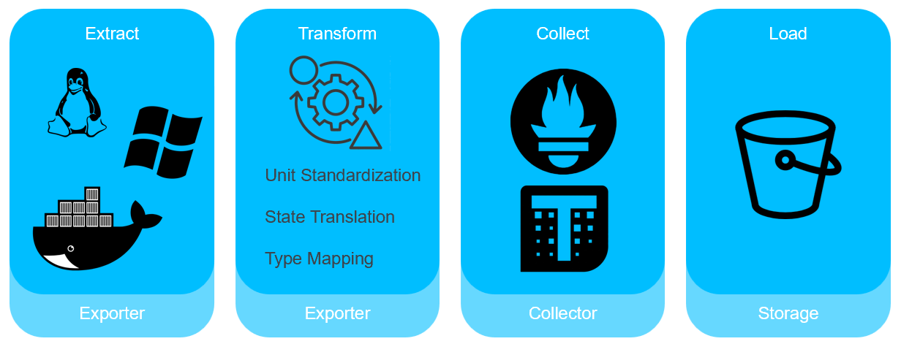
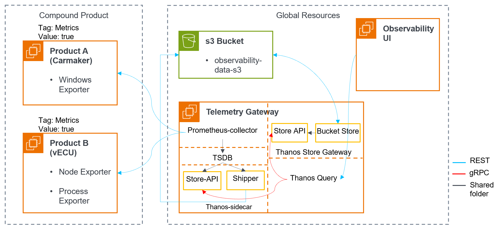
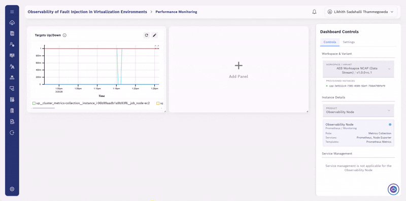
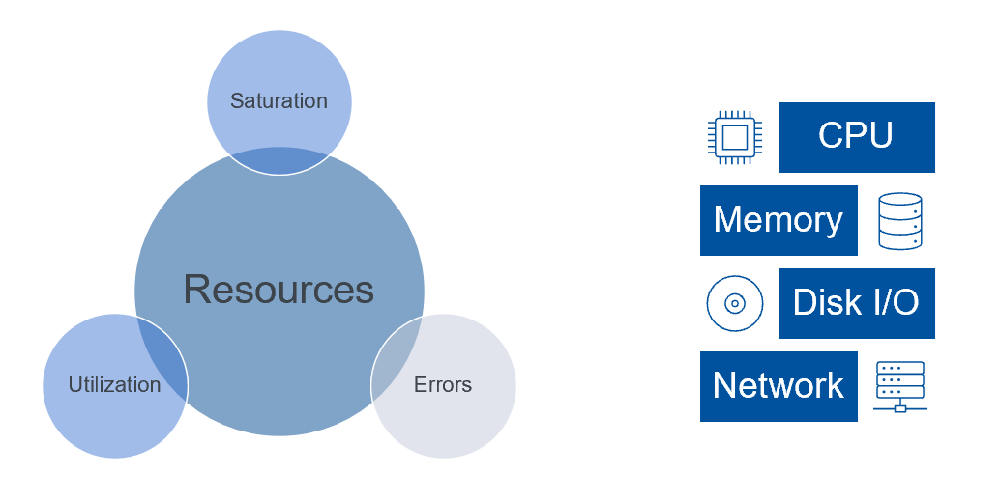
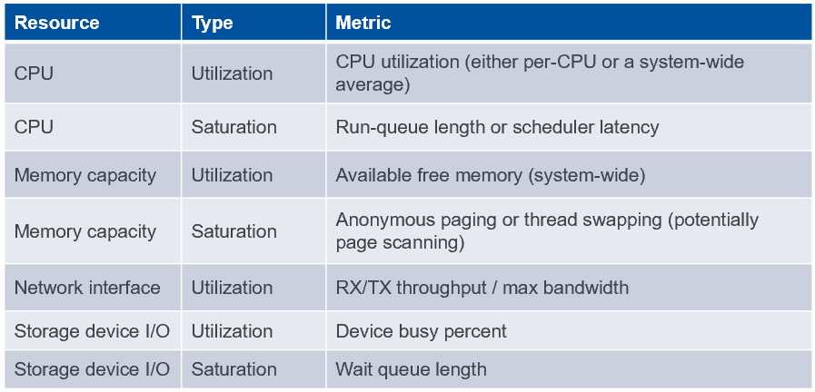
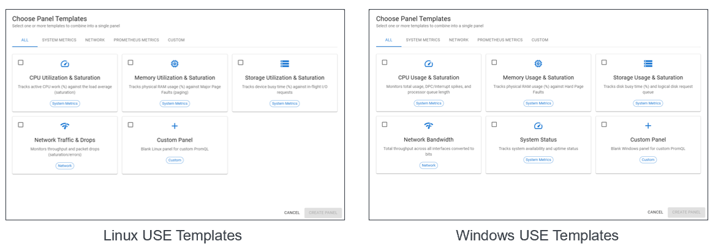

# Observability Framework

## Introduction
A significant challenge remains in understanding
the causal relationship between underlying compute resource utilization and simulation fidelity.

This is a implementation of observability framework designed to monitor the specific compute node resources that dictate simulation performance. The framework addresses the need for
high customizability and platform independence while minimizing the observer effect on simulation tasks.

## Observability Challenges
Monitoring distributed systems introduces several key observability challenges that this project aims to address:
- **Metrics Extraction:** Extracting useful metrics from various sources like nodes running windows, linux or from containers.
- **Metrics Aggregation:** Collecting and correlating compute nodes, containers metrics in a centralized, easily searchable repository.
- **High Cardinality Metrics:** Storing and querying metrics with complex, multidimensional labels without overwhelming the telemetry backend. And to avoid the associated cost to implement using cloud native solutions.

## Architectural Diagram

### Components and Roles
- **Exporters (Windows, Node, Process Exporters):** Standalone processes that collect system metrics from third-party systems or applications (e.g., Carmaker, vECU) and expose them via an HTTP endpoint in Prometheus' exposition format.
- **Collector (Prometheus):** A Cloud Native Computing Foundation project for systems and service monitoring. Using a pull model, it directly scrapes metrics from discovered targets (exporters) at configured intervals to evaluate rules and trigger alerts.
- **Thanos Sidecar:** Deployed along with the Prometheus instance. It implements Thanos’ Store API on top of Prometheus’ remote-read API, allowing queriers to treat Prometheus as a time series data source. It also uploads TSDB blocks to the S3 bucket as Prometheus produces them, ensuring historical data is durable while allowing Prometheus to run with relatively low retention.
- **Thanos Store (Store Gateway):** Implements the Store API on top of historical data in the S3 bucket. It acts primarily as an API gateway—keeping a small amount of remote block information synced on local disk—and therefore does not require significant local disk space.
- **Thanos Query (Querier):** Implements the Prometheus HTTP v1 API to evaluate PromQL queries. It gathers the necessary data from underlying Store APIs (Thanos Sidecar for recent data, Thanos Store for historical), evaluates the query, and returns the combined result to the Observability UI.

## Demonstration

### Observability Dashboard

*A demonstration of Observability dashboard showing the metrics collected for various sources (different nodes in the cloud) and the services responsible for metrics collected.* 

### Fault Injection with live metrics and log update

*Injecting Fault to the nodes running simulation and observing how injected faults affects the resource consumption.*

## USE Method
The Utilization Saturation and Errors (USE) Method is a methodology for analyzing the performance of any system. It directs the construction of a checklist, which for server analysis can be used for quickly identifying resource bottlenecks or errors.

### Performance Checklist
Having extracted the metrics from various sources, it is was important to give the end user a mental framework to track down any performance issues that the user is enountering. So here we have a checklist to look out for.
which helps to explain and resolve the problem in most of the cases.

### Templates Inspired by USE Method 
The templates for the observability dashboard based on the type of source the metrics is being extracted. These templates come with preloaded queries that are inspired by USE Method.

